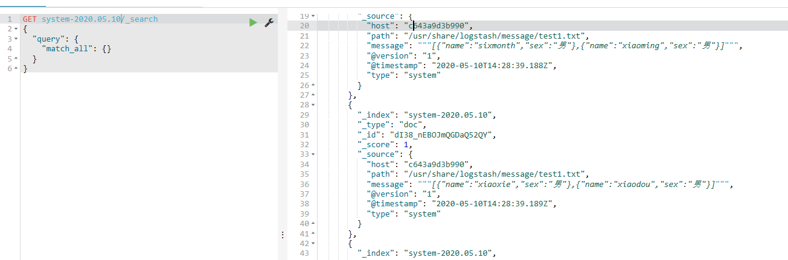

## docker搭建ELK日志系统


### elasticsearch 搭建

* 先创建一个网络组,

```shell
docker network create test
```

* 启动elasticsearch，会拉取最新的elasticsearch

```shell
docker run -p 9200:9200 -p 9300:9300 --network test -e  "ES_JAVA_OPTS=-Xms512m -Xmx512m"  -d elasticsearch
```

* 检查elasticsearch是否启动

```shell
curl http://127.0.0.1:9200/
```

#### 常见异常情况

* max virtual memory areas vm.max_map_count [65530] is too low, increase to at least [262144]
  * 解决方案 
    * 修改虚拟机的 vi /etc/sysctl.conf
    * vm.max_map_count=655360 
    * 重新docker 启动es
* 内存不够报错
  * 进入已启动的容器，修改config目录的jvm.option 中的Xms跟Xmx的值
  * 在容器内执行es的启动脚本启动


### kibana搭建

* 启动 kibana

```she
docker run -p 5601:5601 --network test -e ELASTICSEARCH_URL=http://127.0.0.1:9200/ -d kibana
```

* 直接浏览器访问页面即可 http://localhost:5601/


### logstash搭建

* 启动logstash 

``` shell
docker run --network test -itd logstash /bin/bash
```

* docker ps 查看logstash的容器ID，然后docker exec -it 容器ID /bin/bash
* cd config 目录，可修改 jvm.option，logstash.yml等文件
* 在config下，编写一个 elk.conf ，以txt文件为例

```shell

input {
        file { 
                path => "/usr/share/logstash/message/*.txt" # 目录下的全部txt结尾的文件
                type => "system"  # es文档加一type字段内容
                start_position => "beginning" # 监听文件的起始位置
        }
}
output {
        elasticsearch {
                hosts => ["127.0.0.1:9200"]  # es地址
                index => "system-%{+YYYY.MM.dd}" # es上索引的名称
        }
}
```

* 启动logstash 并指定 elk.conf 

```shel
/usr/share/logstash/bin/logstash -f  /usr/share/logstash/config/elk.conf
```

* 在/usr/share/logstash/message目录下创建一些txt格式的文件，并写入内容

```shell
vi /usr/share/logstash/message/test1.txt 
[{"name":"xiaohong","sex":"男"},{"name":"xiaolv","sex":"男"}]
[{"name":"sixmonth","sex":"男"},{"name":"xiaoming","sex":"男"}]
```

* kibana上查看es中索引是否有新增，索引是否有内容



