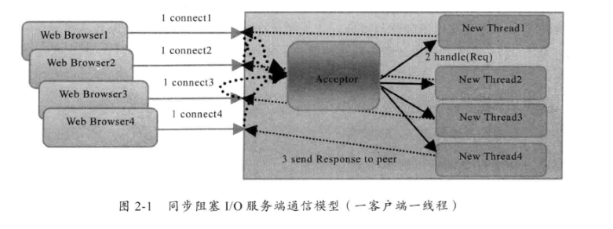
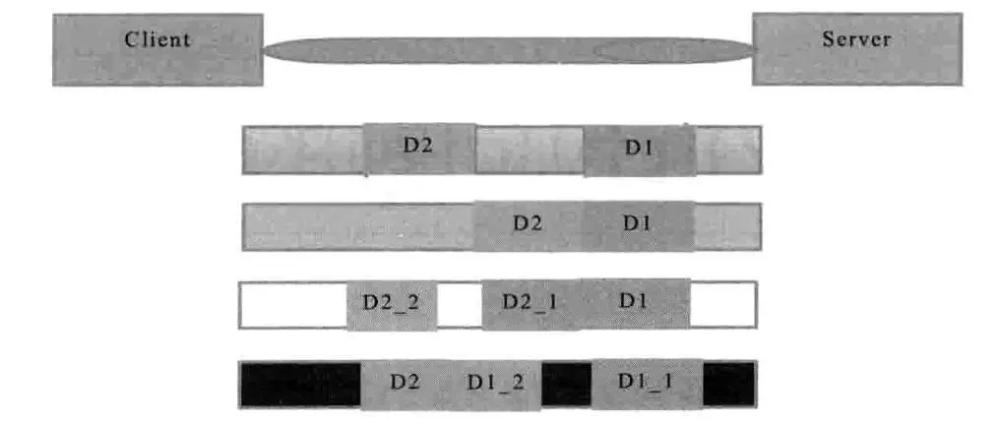

# java aio,bio,nio,netty相关

#### bio通信模型：同步式阻塞IO
> 采用BIO通信模型的服务端，通常有一个独立的Acceptor线程负责监听客户端的连接，它接收客户端连接请求之后为每一个客户端创建一个新的线程进行链路处理，处理完成之后，通过输出流返回应答给客户端，线程销毁，这就是典型的一请求一应答通信模型。

* 缺点在于缺乏弹性伸缩能力，当客户端并发访问量增加的后，服务端的线程个数和客户端并发访问数呈1：1的正比关系。  

* 为了避免服务端线程个数与客户端并发访问数呈正比增长，使用线程池，避免线程创建过多。

代码请参考：io文件夹下的progress的com.study.bio里面的内容

#### nio通信模型:非阻塞IO

#### netty入门

服务端 
1. 定义EventLoopGroup，定义BootServerStrap（group，channel，option，childHandler）
2. childhandler的类为实现ChannelInitializer的实现类，并实现initChannel方法
3. initchannel里面引入ChannelHandlerAdapter的实现类，
4. ChannelHandlerAdapter实现类实现channelRead ，channelReadComplete，exceptionCaught方法
5. 绑定端口 ChannelFuture
6. 关闭端口

客户端
1. 定义EventLoopGroup，定义BootStrap（group，channel，option，handler）
2. childhandler的类为实现ChannelInitializer的实现类，并实现initChannel方法
3. initchannel里面引入ChannelHandlerAdapter的实现类，
4. ChannelHandlerAdapter实现类实现channelActive，channelRead，exceptionCaught方法
5. 连接端口 ChannelFuture
6. 关闭客户端

TCP粘包、拆包

> 假设客户端分别发送了两个数据包，D1和D2给服务端，由于服务端一次读取到的字节数是不确定的，故可能存在以下情况：
1. 服务端分别收到了D1和D2，没有粘包和拆包
2. 服务端一次性收到了D1和D2，称为TCP粘包
3. 服务端两次读取到了两个数据包，第一次读到了D1的完整部分和D2的部分数据，第二次读到了D2的剩余部分。 这称为TCP拆包
4. 服务端两次读取到两个数据包，第一次是D1的部分，第二次是D1的剩余部分和D2的完整部分
5. 滑动窗口太小，而数据包D1和D2非常大，期间发生多次拆包。

原因：

1. 应用程序write写入的字节大小大于套接口发送缓冲区大小
2. 进行MSS大小的TCP分段
3. 以太网帧的payload大于MTU进行IP分片

解决策略
1. 消息定长
2. 在包尾增加回车换行符进行分割
3. 将消息分为消息头和消息体，消息头包含消息体的长度
4. 更复杂的应用层协议
 

netty解决方案
* 利用LineBasedFrameDecoder解决TCP粘包问题，在handler中增加LineBasedFrameDecoder以及StringDecoder，在每一个消息体后新增一个System.getProperty("line.separator")

 * 原理是它会依次遍历ByteBuf中的可读字节，判断看是否有"\n"或者"\r\n"，如果有，就依次位置为结束位置，从可读索引到结束位置区间的字节就组成一行.

* 利用DemilterBasedFrameDecoder可以设定字符串结尾的
* 利用FixedLengthFrameDecoder设置每一次要发送字符串的个数

