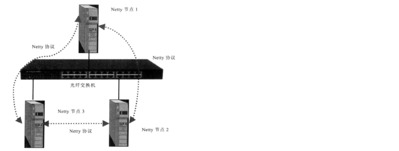

# java aio,bio,nio,netty相关

#### bio通信模型：同步式阻塞IO
> 采用BIO通信模型的服务端，通常有一个独立的Acceptor线程负责监听客户端的连接，它接收客户端连接请求之后为每一个客户端创建一个新的线程进行链路处理，处理完成之后，通过输出流返回应答给客户端，线程销毁，这就是典型的一请求一应答通信模型。

* 缺点在于缺乏弹性伸缩能力，当客户端并发访问量增加的后，服务端的线程个数和客户端并发访问数呈1：1的正比关系。  

* 为了避免服务端线程个数与客户端并发访问数呈正比增长，使用线程池，避免线程创建过多。

代码请参考：io文件夹下的progress的com.study.bio里面的内容

#### nio通信模型:非阻塞IO

#### netty入门

服务端 
1. 定义EventLoopGroup，定义BootServerStrap（group，channel，option，childHandler）
2. childhandler的类为实现ChannelInitializer的实现类，并实现initChannel方法
3. initchannel里面引入ChannelHandlerAdapter的实现类，
4. ChannelHandlerAdapter实现类实现channelRead ，channelReadComplete，exceptionCaught方法
5. 绑定端口 ChannelFuture
6. 关闭端口

客户端
1. 定义EventLoopGroup，定义BootStrap（group，channel，option，handler）
2. childhandler的类为实现ChannelInitializer的实现类，并实现initChannel方法
3. initchannel里面引入ChannelHandlerAdapter的实现类，
4. ChannelHandlerAdapter实现类实现channelActive，channelRead，exceptionCaught方法
5. 连接端口 ChannelFuture
6. 关闭客户端

TCP粘包、拆包

> 假设客户端分别发送了两个数据包，D1和D2给服务端，由于服务端一次读取到的字节数是不确定的，故可能存在以下情况：
1. 服务端分别收到了D1和D2，没有粘包和拆包
2. 服务端一次性收到了D1和D2，称为TCP粘包
3. 服务端两次读取到了两个数据包，第一次读到了D1的完整部分和D2的部分数据，第二次读到了D2的剩余部分。 这称为TCP拆包
4. 服务端两次读取到两个数据包，第一次是D1的部分，第二次是D1的剩余部分和D2的完整部分
5. 滑动窗口太小，而数据包D1和D2非常大，期间发生多次拆包。

原因：

1. 应用程序write写入的字节大小大于套接口发送缓冲区大小
2. 进行MSS大小的TCP分段
3. 以太网帧的payload大于MTU进行IP分片

解决策略
1. 消息定长
2. 在包尾增加回车换行符进行分割
3. 将消息分为消息头和消息体，消息头包含消息体的长度
4. 更复杂的应用层协议
 

netty解决方案
* 利用LineBasedFrameDecoder解决TCP粘包问题，在handler中增加LineBasedFrameDecoder以及StringDecoder，在每一个消息体后新增一个System.getProperty("line.separator")

 * 原理是它会依次遍历ByteBuf中的可读字节，判断看是否有"\n"或者"\r\n"，如果有，就依次位置为结束位置，从可读索引到结束位置区间的字节就组成一行.

* 利用DemilterBasedFrameDecoder可以设定字符串结尾的
* 利用FixedLengthFrameDecoder设置每一次要发送字符串的个数

### 编解码技术

* java序列化的缺点
	* 无法跨语言
	* 序列化后的码流太大
	* 序列化性能太低

* 主流框架
	*  Protobuf
	*  Thrift
	*  Marshalling

### MessagePack编解码

特点：
* 编解码高效，性能高
* 序列化之后的码流小
* 支持跨语言

### HTTP协议开发应用

> HTTP协议：是属于应用层的面向对象的协议，由于其简捷、快速的方式，适用于分布式超媒体信息系统。

主要特点：
* 支持Client/Server模式
* 简单-请求服务时，只需指定服务URL，携带必要的请求参数或者消息体
	* url : http://host{":port"}{abs_path}
	* 请求消息：
		* http请求行：以一个方法符开头，以空格分开，后面跟着请求的url和协议的版本
		* http消息头
		* 请求消息头
			* Accept：用于指定客户端接收那些类型的信息
			* Accept-Charset：用于指定客户端接收的字符集
			* Accept-Encoding：用于指定可接收的内容编码
			* Accept-Language：指定一种自然语言
			* Authorization：证明客户端有权查看某个资源
			* Host：发送请求时，用于指定被请求资源的主机和端口号
			* User-Agent：允许客户端将它的操作系统，浏览器和其他属性告诉服务器
			* Content-Length：请求消息体的长度
			* Content-Type：表示后面的文档属于什么类型
			* Connection：连接类型
		* 响应消息
			* 1xx:指示消息，请求已接收，继续处理
			* 2xx：成功。表示请求一杯成功接收、理解、接受
			* 3xx：重定向。要完成请求必须进行更进一步的操作
			* 4xx：客户端错误，请求有语法错误或请求无法实现
			* 5xx：服务器端错误。服务器未能处理请求。
		* http请求正文
* 灵活--Http允许传输任意类型的数据对象，传输的内容类型由HTTP消息头中的Content-Type加以标记
* 无状态--Http协议是无状态协议，无状态协议是值协议对于事务处理没有记忆能力。缺少状态意味着如果后续处理需要之前的信息，则它必须重传，这样可能导致每次连接传送的数据量增大，另一方面，在服务器不需要先前信息时它的应答就较快，负载较轻。

### netty协议栈功能设计

> netty协议栈用于内部各模块之间的通信，它基于TCP/IP协议栈，是一个类HTTP协议的应用层协议栈，相比于传统的标准协议栈，它更加轻巧、灵活和实用。

在分布式组网环境下，每个Netty节点之间建立场连接，实用Netty协议进行通信。Netty节点并没有服务端和客户端的区分，谁首先发起连接，谁就作为客户端，另一方就是服务端。

特点：
* 基于Netty的NIO通信框架，提供高性能的异步通信能力
* 提供信息的编解码框架，可以实现POJO的序列化和反序列化
* 提供给基于IP地址的白名单接入认证机制
* 链路的有效性校验机制
* 链路的断连重连机制

