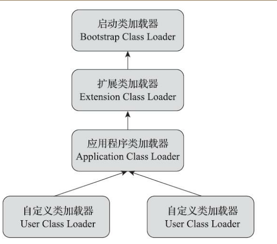

### Class文件内容

* 魔数：OXCAFEBABY
* 次版本号：
* 主版本号：高版本支持加载低版本的类，jdk 6 == 50

* 常量池：从1开始计数
* 类索引，父类索引，接口集合：
* 字段表：
* 方法表：
* 属性表：

#### 类加载

> * 当遇到new，调用或者设置静态类的属性时，调用静态方法，如果类没有被初始化。
>
> * 反射对类型进行调用。
>
> * 当初始化类时，发现父类没有初始化，先触发父类的初始化。
> * 当虚拟机启动时，用户指定需要执行一个主类，虚拟机会先初始化这个主类
> * 当使用JDK 7新加入的动态语言支持时，如果一个java.lang.invoke.MethodHandle实例最后的解析结果为REF_getStatic、REF_putStatic、REF_invokeStatic、REF_newInvokeSpecial四种类型的方法句柄，并且这个方法句柄对应的类没有进行过初始化，则需要先触发其初始化。
> * 当一个接口中定义了JDK 8新加入的默认方法（被default关键字修饰的接口方法）时，如果有这个接口的实现类发生了初始化，那该接口要在其之前被初始化。
>
> 则会触发初始化阶段

* 加载
  * 通过一个类的全限定名来获取定义此类的二进制字节流
  * 将这个字节流所代表的静态存储结构转换方法区的运行时数据结构
  * 在内存中生成一个代表这个类的java.lang.Class对象，作为方法区这个类的各种数据的访问入口
* 验证
  * 文件格式验证
    * 是否以魔数开头
    * 主次版本号是否是当前虚拟机可接收范围
    * 常量池是否有常量指向不被支持的常量类型
    * 指向常量的索引有没有指向不存在的常量
    * CONSTANT_Utf8_info型的常量有没有不符合utf8类型的数据
    * Class文件各部分及文件本身有没有被删除的或者其他附加的数据
  * 元数据验证
    * 这个类是否有父类
    * 这个类是否有继承不能被继承的父类
    * 如果这个类不是抽象类，有没有实现父类的所有的抽象方法
    * 这个类的属性方法有没有跟父类的冲突
  * 字节码验证（通过数据流分析和控制流分析确定语法语义是合法的符合逻辑的）
    * 保证任意时刻操作数栈的数据类型与指令代码序列都能配合工作，例如不会出现类似于“在操作栈放置了一个int类型的数据，使用时却按long类型来加载入本地变量表中”这样的情况。
    * 保证任何跳转指令都不会跳转到方法体以外的字节码指令上。
    * 保证方法体中的类型转换总是有效的，例如可以把一个子类对象赋值给父类数据类型，这是安全的，但是把父类对象赋值给子类数据类型，甚至把对象赋值给与它毫无继承关系、完全不相干的一个数据类型，则是危险和不合法的。
  * 符号引用验证
    * 符号引用中通过字符串描述的全限定名是否能找到对应的类。
    * 在指定类中是否存在符合方法的字段描述符及简单名称所描述的方法和字段。
    * 符号引用中的类、字段、方法的可访问性（private、protected、public、<package>）是否可被当
      前类访问。
* 准备：为类属性赋予类型的初始值
* 解析：会将常量池的符号引用替换为直接引用的过程
  * 类文件解析
  * 字段解析
  * 方法解析
  * 接口方法解析
* 初始化
* 使用
* 卸载

#### 类与类加载器

> 任何一个类，都必须有他的类加载器和这个类本身确定其在java虚拟机中的唯一性。每一个类加载器都有一个独立的类名称空间。

ps：比较两个类是否相等，这两个类必须是同一个类加载器加载，如果两个类不是由同一个类加载器加载的，那么这两个类必定不相等。

#### 双亲委派模型

* 启动类加载器：加载/JAVA_HOME/lib下的类，或者是-Xbootclasspath所指定的类库
* 扩展类加载器：这个类加载器是在类sun.misc.Launcher$ExtClassLoader中以Java代码的形式实现的。它负责加载<JAVA_HOME>\lib\ext目录中，或者被java.ext.dirs系统变量所指定的路径中所有的类库。
* 应用类加载器：这个类加载器由sun.misc.Launcher$AppClassLoader来实现。由于应用程序类加载器是ClassLoader类中的getSystem-ClassLoader()方法的返回值，所以有些场合中也称它为“系统类加载器”。它负责加载用户类路径（ClassPath）上所有的类库，开发者同样可以直接在代码中使用这个类加载器。如果应用程序中没有自定义过自己的类加载器，一般情况下这个就是程序中默认的类加载器。

* 自定义加载器：由用户自行定义的类加载器。

双亲委派模型规定：除了启动类加载器没有父加载器外，其他的加载器都是有父加载器的，他们之前并不是通过继承来实现的，而是使用组合方式实现复用父加载器。

* 工作过程：当一个类加载器收到类加载的请求时，并不主动加载这个类，而且将这个类委派给父类加载器去完成。每一个层次的类加载器都是如此，因此所有的加载请求最终都应该传送到最顶层的启动类加载器中，只有当父类加载器反馈加载不了此类时（它搜索范围没找到此类），子加载器才会尝试的去加载此类。

* 好处：就是Java中的类随着它的类加载器一起具备了一种带有优先级的层次关系。例如类java.lang.Object，它存放在rt.jar之中，无论哪一个类加载器要加载这个类，最终都是委派给处于模型最顶端的启动类加载器进行加载，因此Object类在程序的各种类加载器环境中都能够保证是同一个类。反之，如果没有使用双亲委派模型，都由各个类加载器自行去加载的话，如果用户自己也编写了一个名为java.lang.Object的类，并放在程序的ClassPath中，那系统中就会出现多个不同的Object类，Java类型体系中最基础的行为也就无从保证，应用程序将会变得一片混乱。

