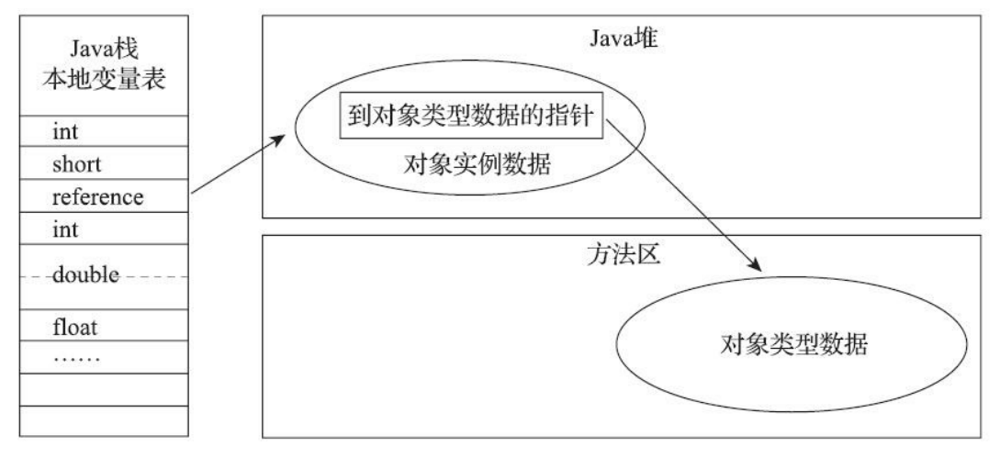

### 运行时数据区域

> Java虚拟机在执行Java程序的过程中会把它所管理的内存划分为若干个不同的数据区域。这些区域有各自的用途，以及创建和销毁的时间，有的区域随着虚拟机进程的启动而一直存在，有些区域则是依赖用户线程的启动和结束而建立和销毁。

* 程序计数器：是一块较小的内存空间，它可以看做是当前线程所执行的字节码的行号指示器。在Java虚拟机的概念模型里，字节码解释器工作时就是通过改变这个计数器的值来选取下一条指令，它是程序控制流的指示器，分支，循环，跳转，异常处理，线程恢复等基础功能都需要依赖这个计数器来完成。
  * 如果线程正在执行的是一个Java方法，这个计数器记录的是正在执行的虚拟机字节码指令的地址。
  * 如何正在执行的是本地(Native)方法，这个计数器值则应为空（Undefined）。
  * 此内存区域是唯一一个在Java虚拟机规范中没有规定任何OutOfMemoryError情况的区域。 
* Java虚拟机栈：也是线程私有的，它的生命周期与线程相同。虚拟机栈描述的是Java方法执行的线程内存模型：每个方法被执行的时候，Java虚拟机都会同步创建一个栈帧用于存储局部变量表、操作数栈、动态链接、方法出口灯信息。每一个方法被调用直至执行完毕的过程，就对应着一个栈帧在虚拟机栈中从入栈到出栈的过程。
  * 局部变量表：存放了编译期可知的各种Java虚拟机基本数据类型（boolean，byte，char，short，int，long，float，double）、对象引用（reference类型，它并不等同于对象本身，可能是一个指向对象起始地址的引用指针，也可能是指向一个代表对象的句柄或者其他与此对象相同的位置）和returnAddress类型（指向了一条字节码指令的地址。）
  * 这些数据类型在局部变量表中的存储空间以局部变量槽表示。其中64位长度的long和double类型的数据会占用两个变量槽。其余的数据类型只占用一个变量槽，局部变量表所需的内存空间在编译期间完成分配，当进入一个方法时，这个方法需要在栈帧中分配大小的局部变量空间是完全确定的。在方法运行期间不会改变局部变量表的大小。
  * 如果线程请求的栈深度大小虚拟机所允许的深度，将抛出StackOverflowError异常。如何Java虚拟机栈容量可以动态扩展，当栈扩展时无法申请到足够的内存会抛出OutOfMemoryError异常。
* 本地方法栈：以Java虚拟机栈相同。

* 堆：java内存区域最大的一块区域，是所有线程共享的，所有的java对象都在堆上分配内存。
  * 如果从分配内存的角度看，所有线程共享的Java堆中可以划分出多个线程私有的分配缓冲区，已提升对象分配时的效率。

* 方法区：与堆一样，是线程共享的，记载已被虚拟机加载的类的信息，常量，静态变量，即时编译器编译后的代码缓存等数据。
  * 运行时常量池：方法区的一部分，Class文件中除了有类的版本、字段、方法、接口等描述信息外，还有一项信息是常量池表（Constant Pool Table），用于存放编译期生成的各种字面量与符号引用，这部分内容将在类加载后存放到方法区的运行时常量池中。

#### 对象的创建

> 当java虚拟机遇到一条new指令时，首先先去常量池检查是否能找到这个符号引用，并且这个符号引用的类是否已加载，解析和初始化过。如果没有，那必须先执行相应的类加载过程。

##### 内存划分：看回收算法使用具备整理

* 空间划分
  * 指针碰撞：假设Java堆中的内存是规整的，所有被使用的内存都放在一边，所有未被使用的内存都放在另一边，中间放着一个指针作为分界点的指示器。分配内存就是指针向空闲方向挪动一段大小相等的距离。（压缩整理空间会有停顿）
  * 空闲列表：假设java堆中的内存是不规整的，已使用的内存和未使用的内存交错分布，虚拟机需要维护一个未使用的空间的列表，划分内存时需要找到一块内存足够大的空间列表进行分配。（会有碎片）

* 线程安全问题

  * CAS替换，对内存空间进行CAS替换+失败重试。

  * 上文所述，堆上可划成私有的本地线程缓存区，只有当前线程缓存区用完时，才会cas去竞争其他空间。-XX:UseTLAB=true使用

##### 对象的内存布局

> 对象在内存中分为三个区域，对象头，实例数据和对齐填充。对象头一部分存储对象的自身运行时数据，如:GC分代年龄，锁状态标志，一部分存储类型指针，指向它的元数据的指针，虚拟机通过这个确定这个对象是哪个类的实例。但是，如果是数组，在对象头里面还需要一块记录数组的长度，因为普通的对象可以通过元数据确定对象的大小，而数组的元数据无法确定数据的长度，所以需要在对象头里面存储数组的长度。

##### 对象访问方式：

* 句柄：使用句柄，则堆会划分出一块区域作为句柄池，reference引用的就是句柄池的地址，句柄池中有两部分，一部分指向对象类型数据的地址，一部分指向对象实例数据的地址。(reference中存储的是稳定的句柄地址，在对象移动时，只会改变句柄池中实例对象的指针，并不影响reference的引用)。

* 直接指针：直接指向堆中实例数据的地址，减少了一次指针的时间开销。

