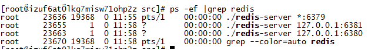

# redis的主从复制


1. 什么是redis主从复制
2. redis主从配置实现
3. redis主从复制原理
	* 增量同步
	* 快照同步
4. redis主从复制的步骤
5. 主机宕机后，如何手动切换新的主机
6. 优缺点


### 什么是redis主从复制

> 主从复制，是指将一台Redis服务器的数据，复制到其他的Redis服务器。前者称为主节点
> (master)，后者称为从节点(slave),数据的复制是单向的，只能由主节点到从节点。默认情况下，每台Redis服务器都是主节点；且一个主节点可以有多个从节点(或没有从节点)，但一个从节点只能有一个主节点。


主从复制的作用：
+ 负载均衡，主节点处理写请求，从节点处理读请求，分担服务器负载，大大提高redis服务器的并发量。
+ 故障恢复 当主节点出现问题时，可以由从节点提供服务，实现快速的故障恢复

### redis主从配置实现

```
	replicaof <masterip> <masterport> ## 主节点的ip以及端口 
	masterauth 123456 ## 同步认证密码
```

主节点配置：
```
	port 6379
```

从节点1配置:
```
	port 6380
	replicaof 127.0.0.1 6379
```
从节点2配置：
```
	port 6381
	replicaof 127.0.0.1 6379
```

启动主节点以及从节点,并且检查redis进程是否存在




检查每个节点的状态


role角色为master则为主节点，slave也就是从节点，redis只支持单主多从，不支持多主模式。


### redis主从复制原理

>	redis主从复制分为快照同步以及增量同步两种方式。注意：redis主从复制并不会阻塞主节点任何处理请求。


* 快照同步
	当从节点连上主节点时，会让主节点进行bgsave操作，然后从节点将进行快照同步。
	增量同步buffer内存环用完，还没同步的指令也给覆盖了，则进行快照同步。

* 增量同步
	在redis主从在运行的时候，主节点进行写请求，将写请求的内容写入内存的buffer环中，然后异步将从指令同步从节点，从节点一边进行同步指令的执行，一边像主节点反馈同步状况。当从节点因为网络原因同步过慢，导致redis的内存buffer环都被用完，还没同步的指令都给覆盖了，则此时会进行快照同步，然后buffer继续接收指令，都会导致同步期间的增量指令在复制 buffer 中被覆盖，这样就会导致快照同步完成后无法进行增量复制，然后会再次发起快照同步，如此极有可能会陷入快照同步的死循环。

#### redis主从复制的步骤
```
	1.连接建立阶段（即准备阶段）
		进行连接，进行权限验证，密码验证等
	2.数据同步阶段
		进行快照同步，从节点向主节点发送bgsave命令，将主节点全量数据同步到数据中，耗时最好
	3.命令传播阶段
		当第2步同步完成后，接下来主节点会持续地把写命令发送给从节点，保证主从数据一致性。
```	


### 主机宕机后，如何手动切换新的主机
redis的主从复制只能保证了redis之间数据的同步，而且当主机挂了之后，整个集群只能提供读操作，并不支持写操作，所以需要人工手动干预，将某一个slave机器提升为master机，并且将其他slave重新同步新的master机。

1.先杀死master的redis进程，并查看redis从机的同步状态

2.master主机已经down，需手动切换，将某一台机器提升为master，这里提升6380端口的slave为主机

3.修改剩下slave机器的状态，将slave机器重新设置同步为新的master主机


redis主机挂了之后，切换新的主机的步骤
* 在某一个slave机上执行 slaveof on one 将自己变成master机
* 在其他slave机子上执行slaveof 新master机的ip 新master机的port


### 优缺点
优点：
1.可以保证redis之间数据的同步
2.负载均衡，分担主节点的压力
3.故障恢复，当主节点挂了之后，可以将其他slave节点提升为主节点

缺点：
1.主节点挂了之后，需手动切换从节点，可以考虑redis的哨兵模式实现redis的高可用
2.数据冗余，相当于每个redis里面都保存大致一样的数据

