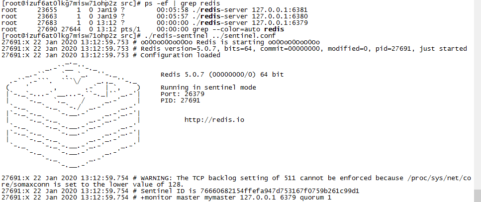
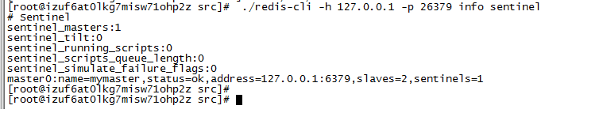
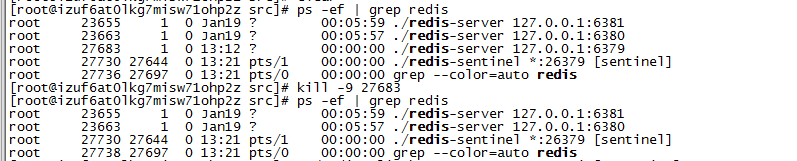
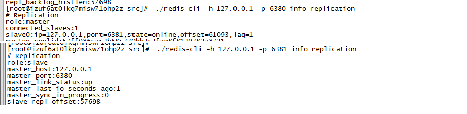

# redis哨兵（Sentinel）模式


1.什么是哨兵模式
2.如何部署哨兵模式
3.哨兵模式的作用


### 什么是哨兵模式

redis的主从复制保证了主机以及从机之间数据的相对的一致，并不能保证强一致性，当主机出现故障后，只能提供读请求，并不能接收写请求，需要人工干预将一台从机提升为主机，也会造成一段时间的服务不可用。

### 如何部署哨兵模式

1.先将启动三个redis，并且设置了其中一个为master，另外两个为slave，即redis三个节点之间形成主从同步的模式。
2.配置sentinel.conf配置文件
```
## sentinel monitor <master-name> <ip> <redis-port> <quorum>
## sentinel monitor 监控的主机的名称，ip，端口号，集群中多少个sentinel认为主机已挂，才切换
sentinel monitor mymaster 127.0.0.1 6379 1
```
3.启动redis-sentinel

4.检测redis-sentinel的状态

5.将master的redis的进程杀死

6.重新观察哨兵状态（可以看到master节点已经切换成6380端口的redis。）

7.查看redis各个进程的状态
6380端口的redis已经成为主机，而6381则成为6380redis的从机


### 哨兵模式的作用

哨兵模式是redis高可用的一种模式，作用在于它可以监控redis主机以及从机各个服务器的状态，是否正常，第二在于当发现master挂了之后，会将某一个slave提升为master，将另外的slave成为新的master的从机，可自动执行，并不需要手动监控，而且sentinel之间可以集群搭建，并且配置文件中设置多少个sentinel判断master机挂了之后才切换。

