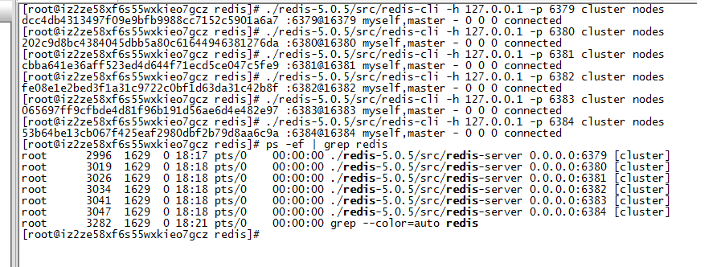

# redis集群 redis-cluster

> redis-cluster架构中，被设计成共有16384个hash slot。每个master分得一部分slot，其算法为：hash_slot = crc16(key) mod 16384 ，这就找到对应slot。采用hash slot的算法，实际上是解决了redis-cluster架构下，有多个master节点的时候，数据如何分布到这些节点上去。key是可用key，如果有{}则取{}内的作为可用key,否则整个可以是可用key。群集至少需要3主3从，且每个实例使用不同的配置文件。


步骤
1. 先配置6个redis.conf文件，并且启动6个redis进程
```
## 以下默认是注释
cluster-enabled yes 
cluster-config-file nodes.conf
cluster-node-timeout 15000
```

2. 使用redis-cli 启动redis-cluster（5.0之前的版本需要使用ruby调用redis-cluster启动）
```
[root@iz2ze58xf6s55wxkieo7gcz src]# ./redis-cli  --cluster create 127.0.0.1:6379 127.0.0.1:6380 127.0.0.1:6381 127.0.0.1:6382 127.0.0.1:6383 127.0.0.1:6384 --cluster-replicas 1 
>>> Performing hash slots allocation on 6 nodes...
Master[0] -> Slots 0 - 5460
Master[1] -> Slots 5461 - 10922
Master[2] -> Slots 10923 - 16383
Adding replica 127.0.0.1:6383 to 127.0.0.1:6379
Adding replica 127.0.0.1:6384 to 127.0.0.1:6380
Adding replica 127.0.0.1:6382 to 127.0.0.1:6381
>>> Trying to optimize slaves allocation for anti-affinity
[WARNING] Some slaves are in the same host as their master
M: dcc4db4313497f09e9bfb9988cc7152c5901a6a7 127.0.0.1:6379
   slots:[0-5460] (5461 slots) master
M: 202c9d8bc4384045dbb5a80c61644946381276da 127.0.0.1:6380
   slots:[5461-10922] (5462 slots) master
M: cbba641e36aff523ed4d644f71ecd5ce047c5fe9 127.0.0.1:6381
   slots:[10923-16383] (5461 slots) master
S: fe08e1e2bed3f1a31c9722c0bf1d63da31c42b8f 127.0.0.1:6382
   replicates 202c9d8bc4384045dbb5a80c61644946381276da
S: 065697ff9cfbde4d81f96b191d56ae6d4e482e97 127.0.0.1:6383
   replicates cbba641e36aff523ed4d644f71ecd5ce047c5fe9
S: 53b64be13cb067f425eaf2980dbf2b79d8aa6c9a 127.0.0.1:6384
   replicates dcc4db4313497f09e9bfb9988cc7152c5901a6a7
Can I set the above configuration? (type 'yes' to accept): yes
>>> Nodes configuration updated
>>> Assign a different config epoch to each node
>>> Sending CLUSTER MEET messages to join the cluster
Waiting for the cluster to join
......
>>> Performing Cluster Check (using node 127.0.0.1:6379)
M: dcc4db4313497f09e9bfb9988cc7152c5901a6a7 127.0.0.1:6379
   slots:[0-5460] (5461 slots) master
   1 additional replica(s)
M: cbba641e36aff523ed4d644f71ecd5ce047c5fe9 127.0.0.1:6381
   slots:[10923-16383] (5461 slots) master
   1 additional replica(s)
S: 065697ff9cfbde4d81f96b191d56ae6d4e482e97 127.0.0.1:6383
   slots: (0 slots) slave
   replicates cbba641e36aff523ed4d644f71ecd5ce047c5fe9
S: 53b64be13cb067f425eaf2980dbf2b79d8aa6c9a 127.0.0.1:6384
   slots: (0 slots) slave
   replicates dcc4db4313497f09e9bfb9988cc7152c5901a6a7
M: 202c9d8bc4384045dbb5a80c61644946381276da 127.0.0.1:6380
   slots:[5461-10922] (5462 slots) master
   1 additional replica(s)
S: fe08e1e2bed3f1a31c9722c0bf1d63da31c42b8f 127.0.0.1:6382
   slots: (0 slots) slave
   replicates 202c9d8bc4384045dbb5a80c61644946381276da
[OK] All nodes agree about slots configuration.
>>> Check for open slots...
>>> Check slots coverage...
[OK] All 16384 slots covered.
``` 
这样集群就搭建完毕


从上述所看，可以发现当key不在本机上时会路由到该key的redis上并获取结果。

