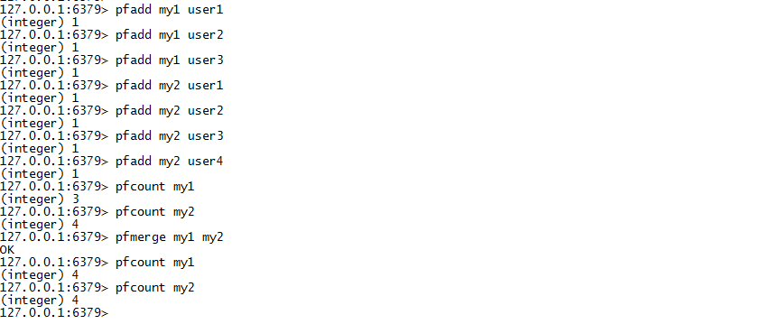
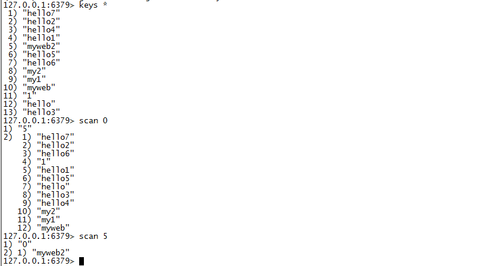
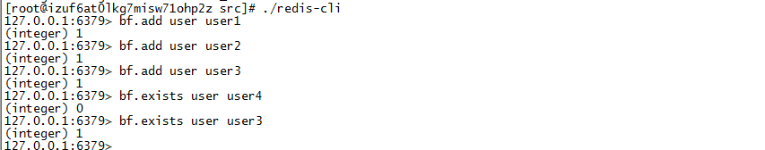

# redis的其他一些应用

* #### redis分布式锁
* #### HyperLogLog
* #### Scan
* #### 布隆过滤器


 
### redis分布式锁
> 为了防止分布式系统中的多个进程之间相互干扰，我们需要一种分布式协调技术来对这些进程进行调度。而这个分布式协调技术的核心就是来实现这个分布式锁。

比如秒杀一个商品，这时候只有最后一件了，同时有三个用户下单，这时候得保证商品数目的一致性，不能出现超买超卖的现象，单机系统一般通过程序设计语言的中多线程同步的锁来实现，比如java的synchronized关键字等其他同步线程的方法，分布式系统通过程序设计语言同步并不行，所以要采取分布式锁，比如redis，zookeeper做分布式锁，redis采用的方法是设置一个key为锁，当其他进程判断锁存在时放弃或者是等待重试。

* 方法1
```
	## 设置一个key，并且设置key的过期时间，超时自动释放锁
	setnx lock true ## 当lock这个key不存在时，才添加key 
	expire lock 5 ## 设置key的过期时间
```
看似方法1很完美，但是存在问题，就是假设你设置了key之后，在expire之前，redis宕机了，那么这个key就永久存在了，就无法释放锁了
* 方法2
```
	set lock true ex 5 nx  ## 通过set设置key并且直接设置过期时间以及设置结果信息
```
原子操作，假设lock这个key不存在则输出ok，存在则为nil，并且设置了过期时间为5s，所以5秒后会自动释放锁。


### HyperLogLog
>HyperLogLog 是用来做基数统计的算法，HyperLogLog 的优点是，在输入元素的数量或者体积非常非常大时，计算基数所需的空间总是固定 的、并且是很小的。在Redis里面，每个HyperLogLog键只需要花费12KB内存，就可以计算接近 2^64 个不同元素的基数。

redis的HyperLogLog提供了三个指令，pfadd pfcount pfmerge
pfadd 为一个key增加value，会排重
pfcount 统计这个key的个数
pfmerge 合并两个key的内容


HyperLogLog可以用做网站的用户统计，统计每天有多少不同的用户登录此系统。


### scan指令

由于redis的单进程的，当redis里面含有大量的key时，如果你要查看所有的key名称时，需要遍历，如果直接keys，虽然keys能进行模式匹配，但是整体操作是O（n），那么这是一个相当慢的过程，其他指令将阻塞，而且keys也没有设定返回多少个符合条件的key，他会全部返回。所以要遍历所有key的名称还是使用scan，scan虽然也是O（n），但是他不会阻塞用户指令，他通过游标分步查找，而且提供limit限制了返回的个数，当执行完scan后他会告诉你下一个游标的编码，知道最后返回为0时则结束。
```
scan cursor [match pattern][count count]
scan 0 ## 从0开始查全部
```
比较keys以及scan的操作


有时候key多的时候，你会发现scan输出统计的一下结果数目不对，在仔细看一下key，有重复的，所以scan会出现key重复的现象，需要自己过滤掉重复的结果。


### 布隆过滤器

> 布隆过滤器（Bloom Filter）是1970年由布隆提出的。它实际上是一个很长的二进制向量和一系列随机映射函数。布隆过滤器可以用于检索一个元素是否在一个集合中。它的优点是空间效率和查询时间都比一般的算法要好的多，缺点是有一定的误识别率和删除困难。

首先得看一下缓存穿透问题，在高并发场景下，如果某一个key被高并发访问，没有被命中，出于对容错性考虑，会尝试去从后端数据库中获取，从而导致了大量请求达到数据库，而当该key对应的数据本身就是空的情况下，这就导致数据库中并发的去执行了很多不必要的查询操作，从而导致巨大冲击和压力。

布隆过滤器可以解决缓存穿透问题，假设一个key是存在的，那么布隆过滤器检索它也一定是存在，假设一个key不存在，那么检索它不一定是不存在的，有误差。

1.先去下载redisbloom的插件[redisbloom插件](https://github.com/RedisBloom/RedisBloom)

2.解压后make，会生成redisbloom.so，启动redis-server并且导入redisbloom模块
```
 ./redis-server --loadmodule /该文件所在目录/redisbloom.so 
```
3.客户端执行指令 pf.add pf.exists



