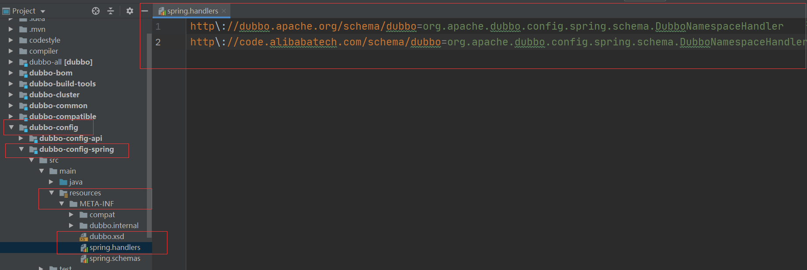
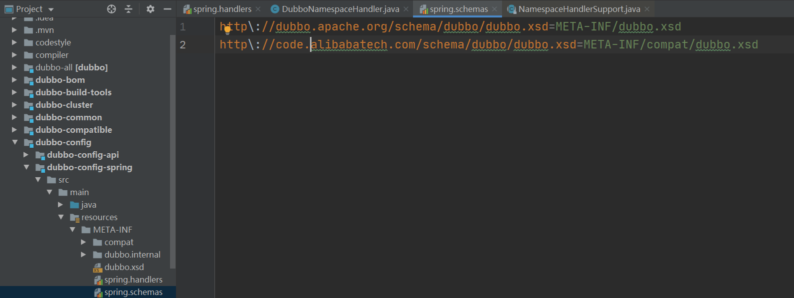

dubbo采用spring自定义标签实现xml功能

* 例如  \<dubbo:reference> ,\<dubbo:service>，\<dubbo:registry>等

知识点：  spring自定义标签  ,读取xml

​	spring默认标签 \<beans>、\<bean>、\<import>等

自定义标签实现：

* 命名空间中元素的处理，通过何种handler处理，在 META-INF/spring.handlers文件保存映射关系。当spring在解析配置文件时，碰到指定的命名空间的元素，便使用对应的handler进行元素元素处理。（先读取xml文件，然后获取每个节点的元素Element,根据不同的element进行不同的处理)

  * xsd文件是用来校验xml文档中标签的内容是否有用的，也就是验证xml文件

  * dubbo的spring.handlers配置在dubbo-config模块下的resources下 META-INF/spring.handlers文件（spring启动会加载）

    * 格式	命名空间 = 处理这个标签的类（需要继承NamespaceHandlerSupport类 即命名空间处理器）

    

  * spring.schemas 配置的是xsd文件所在的位置 （spring启动会加载）

    * 格式： xsd的命名空间 = xsd文件所在

    

  * 提供命名空间解析器 需要实现 BeanDefinitionParser（解析Element标签内容生成对应的beandefinition对象（spring存储标签元素内容都是以beandefinition对象存储））

---

例子：

​	自定义实现spring的标签   依赖spring框架

1. 先写xsd ，xsd文件内容可模仿学习

```xml
<?xml version="1.0" encoding="UTF-8" ?>
<xsd:schema xmlns:xsd="http://www.w3.org/2001/XMLSchema"
            xmlns="http://test.myelement.com/schema/myelement"
            targetNamespace="http://test.myelement.com/schema/myelement">
    <!-- 节点element标签 -->
    <xsd:element name="my">
        <xsd:complexType>
            <!-- element的子节点的元素 -->
            <xsd:sequence>
                <xsd:element name="property">
                    <xsd:complexType>
                        <xsd:attribute name="name" type="xsd:string"></xsd:attribute>
                        <xsd:attribute name="value" type="xsd:string"></xsd:attribute>
                    </xsd:complexType>
                </xsd:element>
            </xsd:sequence>
            <!-- attribute为 element的元素  name为名称 type为数据类型 -->
            <xsd:attribute name="id" type="xsd:int" ></xsd:attribute>
            <xsd:attribute name="name" type="xsd:string" ></xsd:attribute>
        </xsd:complexType>
    </xsd:element>

</xsd:schema>
<!--
    xsd文件所写的最终的xml内容最终结构为
    <my id="" name="">
        <property name="" value=""></property>
    </my>
-->
```

2. 提供一个实现了NamespaceHandlerSupport的类 以及该标签的处理类（需要实现BeanDefinitionParse接口） 和编写META-INF/spring.handlers

   NamespaceHandlerSupport实现类

   ```java
   package com.myhandler;
   
   import org.springframework.beans.factory.xml.NamespaceHandlerSupport;
   
   /**
    * 命名空间处理类,主要是生成对应的 命名空间解析类加入到spring容器中
    *
    * @author edithking
    */
   public class MyElementHandler extends NamespaceHandlerSupport {
       public void init() {
           // xsd中对应的根的element的元素
           registerBeanDefinitionParser("my",new MyElementParse());
       }
   }
   
   ```

   BeanDefinitionParse接口实现类

   ```java
   package com.myhandler;
   
   import com.entity.MyElement;
   import org.springframework.beans.factory.support.BeanDefinitionBuilder;
   import org.springframework.beans.factory.xml.AbstractSingleBeanDefinitionParser;
   import org.w3c.dom.Element;
   import org.w3c.dom.Node;
   
   import java.util.HashMap;
   
   /**
    * 标签解析类
    *
    * @author edithking
    */
   public class MyElementParse extends AbstractSingleBeanDefinitionParser {
   
       @Override
       protected Class<?> getBeanClass(Element element) {
           // 生成一个BeanDefinition
           return MyElement.class;
       }
   
       @Override
       protected void doParse(Element element, BeanDefinitionBuilder builder) {
           String name = element.getAttribute("name");
           Integer id = Integer.valueOf(element.getAttribute("id"));
           // 使用BeanDefinitionBuilder给BeanDefinition赋值
           builder.addPropertyValue("id", id);
           builder.addPropertyValue("name", name);
           /**
            * 遍历子节点
            */
           HashMap hashMap = new HashMap();
           for (int i = 0; i < element.getChildNodes().getLength(); i++) {
               Node node = element.getChildNodes().item(i);
               if (node instanceof Element) {
                   Element temp = (Element) node;
                   String tempName = temp.getAttribute("name");
                   String tempValue = temp.getAttribute("value");
                   hashMap.put(tempName, tempValue);
               }
           }
           builder.addPropertyValue("property", hashMap);
       }
   }
   
   ```

   META-INF/spring.handlers文件

   ```properties
   http\://test.myelement.com/schema/myelement=com.myhandler.MyElementHandler
   ```

3. 编写META-INF/spring.sechemas

   ```properties
   http\://test.myelement.com/schema/myelement/myelement.xsd=META-INF/myelement.xsd
   ```

4. 测试

   application.xml

   ```xml
   <?xml version="1.0" encoding="UTF-8"?>
   <beans xmlns:xsi="http://www.w3.org/2001/XMLSchema-instance"
          xmlns:myelment="http://test.myelement.com/schema/myelement"
          xmlns="http://www.springframework.org/schema/beans"
          xsi:schemaLocation="http://www.springframework.org/schema/beans
          http://www.springframework.org/schema/beans/spring-beans.xsd
          http://test.myelement.com/schema/myelement
          http://test.myelement.com/schema/myelement/myelement.xsd">
   
       <myelment:my id="1" name="xiaoxiao">
           <myelment:property name="yuwen" value="100"/>
       </myelment:my>
   </beans>
   ```

   ```java
   package com;
   
   import com.entity.MyElement;
   import org.springframework.beans.factory.BeanFactory;
   import org.springframework.beans.factory.xml.XmlBeanFactory;
   import org.springframework.core.io.ClassPathResource;
   
   public class Test {
       public static void main(String[] args) {
           ClassPathResource isr = new ClassPathResource("application.xml");
           BeanFactory applicationContext = new XmlBeanFactory(isr);
           MyElement myElement = applicationContext.getBean(MyElement.class);
           System.out.println(myElement);
       }
   }
   
   ```

5. 结果


---

源码流程解析, 解析xml文档，并且进行xsd验证，以及生成BeanDefinition

1. BeanFactory 
   * 提供获取Bean的方法
   * 解析xml文件等其他类型文件的资源

```java
public class XmlBeanFactory extends DefaultListableBeanFactory {

    // xml文件处理器
	private final XmlBeanDefinitionReader reader = new XmlBeanDefinitionReader(this);

	public XmlBeanFactory(Resource resource) throws BeansException {
		this(resource, null);
	}

	public XmlBeanFactory(Resource resource, BeanFactory parentBeanFactory) throws BeansException {
		super(parentBeanFactory);
        // 加载文件资源中的BeanDefinition
		this.reader.loadBeanDefinitions(resource);
	}

}
```

2. XmlBeanDefinitionReader类    
   * 进行资源处理

```java
	@Override
	public int loadBeanDefinitions(Resource resource) throws BeanDefinitionStoreException {
        // 资源内容编码转换
		return loadBeanDefinitions(new EncodedResource(resource));
	}

	 */
	public int loadBeanDefinitions(EncodedResource encodedResource) throws BeanDefinitionStoreException {
		Assert.notNull(encodedResource, "EncodedResource must not be null");
		if (logger.isTraceEnabled()) {
			logger.trace("Loading XML bean definitions from " + encodedResource);
		}
		// 使用ThreadLocal，获取当前线程正在解析的资源
        // ThreadLocal是处理多线程对共享资源处理时，避免其他线程影响当前线程，每个线程会生成一个当前线程的副本，所以你线程修改你的内容，不会影响其他的线程
		Set<EncodedResource> currentResources = this.resourcesCurrentlyBeingLoaded.get();
		// 避免同一资源循环解析
		if (!currentResources.add(encodedResource)) {
			throw new BeanDefinitionStoreException(
					"Detected cyclic loading of " + encodedResource + " - check your import definitions!");
		}

		try (InputStream inputStream = encodedResource.getResource().getInputStream()) {
			InputSource inputSource = new InputSource(inputStream);
			if (encodedResource.getEncoding() != null) {
				inputSource.setEncoding(encodedResource.getEncoding());
			}
            // 处理内容
			return doLoadBeanDefinitions(inputSource, encodedResource.getResource());
		}
		catch (IOException ex) {
			throw new BeanDefinitionStoreException(
					"IOException parsing XML document from " + encodedResource.getResource(), ex);
		}
		finally {
			currentResources.remove(encodedResource);
			if (currentResources.isEmpty()) {
				this.resourcesCurrentlyBeingLoaded.remove();
			}
		}
	}


	public int loadBeanDefinitions(InputSource inputSource) throws BeanDefinitionStoreException {
		return loadBeanDefinitions(inputSource, "resource loaded through SAX InputSource");
	}

	
	public int loadBeanDefinitions(InputSource inputSource, @Nullable String resourceDescription)
			throws BeanDefinitionStoreException {

		return doLoadBeanDefinitions(inputSource, new DescriptiveResource(resourceDescription));
	}


	protected int doLoadBeanDefinitions(InputSource inputSource, Resource resource)
			throws BeanDefinitionStoreException {

		try {
            // 获取文档内容， xml读取流程  DocumentBuilderFactory  -> DocumentBuilder ->Document -> Element
			Document doc = doLoadDocument(inputSource, resource);
            // 
			int count = registerBeanDefinitions(doc, resource);
			if (logger.isDebugEnabled()) {
				logger.debug("Loaded " + count + " bean definitions from " + resource);
			}
			return count;
		}
		// 忽略以下的catch
	}

	
	protected Document doLoadDocument(InputSource inputSource, Resource resource) throws Exception {
        // documentLoader 默认xml文档加载器
		return this.documentLoader.loadDocument(inputSource, getEntityResolver(), this.errorHandler,
				getValidationModeForResource(resource), isNamespaceAware());
	}
```

3. DefaultDocumentLoader类
   * 生成Document文档

```java
@Override
	public Document loadDocument(InputSource inputSource, EntityResolver entityResolver,
			ErrorHandler errorHandler, int validationMode, boolean namespaceAware) throws Exception {
		// 根据命名空间以及验证模式 生成 DocumentBuilderFactory
		DocumentBuilderFactory factory = createDocumentBuilderFactory(validationMode, namespaceAware);
		if (logger.isTraceEnabled()) {
			logger.trace("Using JAXP provider [" + factory.getClass().getName() + "]");
		}
        // 获取DocumentBuilder 生成Document对象
		DocumentBuilder builder = createDocumentBuilder(factory, entityResolver, errorHandler);
		return builder.parse(inputSource);
	}
```

4. XmlBeanDefinitionReader的registerBeanDefinitions的方法
   * 解析xml文档，并且将BeanDefinition注册到spring容器,其实是放在一个Map里面

```java
public int registerBeanDefinitions(Document doc, Resource resource) throws BeanDefinitionStoreException {
    	// 解析document中的每一个Element对象的处理器
		BeanDefinitionDocumentReader documentReader = createBeanDefinitionDocumentReader();
    	// 注册前已经存在了多少个BeanDefinition
		int countBefore = getRegistry().getBeanDefinitionCount();
    	// 解析并且注册 BeanDefinition ， documentReader的类(DefaultBeanDefinitionDocumentReader)
		documentReader.registerBeanDefinitions(doc, createReaderContext(resource));
    	// 此次注册了多少个BeanDefinition
		return getRegistry().getBeanDefinitionCount() - countBefore;
	}
```

5. DefaultBeanDefinitionDocumentReader的registerBeanDefinitions方法
   * 处理标签，包括自定义标签和默认标签的处理，并且将标签的内容生成一个BeanDefinition类的对象来接受xml文档的内容

```java
	@Override
	public void registerBeanDefinitions(Document doc, XmlReaderContext readerContext) {
		this.readerContext = readerContext;
		doRegisterBeanDefinitions(doc.getDocumentElement());
	}
	
	protected void doRegisterBeanDefinitions(Element root) {
		//Bean定义解析器委托
		BeanDefinitionParserDelegate parent = this.delegate;
		this.delegate = createDelegate(getReaderContext(), root, parent);
		// 判断是否是默认的Beans的命名空间,并且做了profile的处理
		// 根据不同环境,配置不同的文件，启动时设置profile就可以指定跑那个配置文件,
		// 比如application-dev.xml application-prod.xml application-uat.xml  当你指定profile为dev时，则跑application-dev.xml
		if (this.delegate.isDefaultNamespace(root)) {
			String profileSpec = root.getAttribute(PROFILE_ATTRIBUTE);
			if (StringUtils.hasText(profileSpec)) {
				String[] specifiedProfiles = StringUtils.tokenizeToStringArray(
						profileSpec, BeanDefinitionParserDelegate.MULTI_VALUE_ATTRIBUTE_DELIMITERS);
				if (!getReaderContext().getEnvironment().acceptsProfiles(specifiedProfiles)) {
					if (logger.isDebugEnabled()) {
						logger.debug("Skipped XML bean definition file due to specified profiles [" + profileSpec +
								"] not matching: " + getReaderContext().getResource());
					}
					return;
				}
			}
		}
		// 空方法,可继承此类，重写这个方法，就可以实在解析BeanDefinition前做处理
		preProcessXml(root);
		// 解析
		parseBeanDefinitions(root, this.delegate);
		// 空方法,可继承此类，重写这个方法，就可以实在解析BeanDefinition后做处理
		postProcessXml(root);

		this.delegate = parent;
	}
	
	protected void parseBeanDefinitions(Element root, BeanDefinitionParserDelegate delegate) {
		// 校验命名空间
		if (delegate.isDefaultNamespace(root)) {
			// 获取每一个节点
			NodeList nl = root.getChildNodes();
			for (int i = 0; i < nl.getLength(); i++) {
				Node node = nl.item(i);
				if (node instanceof Element) {
					Element ele = (Element) node;
					// 判断是默认的命名的标签，还是自定义的标签
					if (delegate.isDefaultNamespace(ele)) {
						parseDefaultElement(ele, delegate);
					}
					else {
						delegate.parseCustomElement(ele);
					}
				}
			}
		}
		else {
			delegate.parseCustomElement(root);
		}
	}
	
	private void parseDefaultElement(Element ele, BeanDefinitionParserDelegate delegate) {
		if (delegate.nodeNameEquals(ele, IMPORT_ELEMENT)) {
            // 处理import
			importBeanDefinitionResource(ele);
		}
		else if (delegate.nodeNameEquals(ele, ALIAS_ELEMENT)) {
            // 处理alias
			processAliasRegistration(ele);
		}
		else if (delegate.nodeNameEquals(ele, BEAN_ELEMENT)) {
            // 处理Bean
			processBeanDefinition(ele, delegate);
		}
		else if (delegate.nodeNameEquals(ele, NESTED_BEANS_ELEMENT)) {
			// 处理Beans
			doRegisterBeanDefinitions(ele);
		}
	}
	protected void processBeanDefinition(Element ele, BeanDefinitionParserDelegate delegate) {
        // 解析Bean节点里面的内容，生成BeanDefinitionHolder，BeanDefinitionHolder这个类由BeanDefinition（对应为Bean元素的pojo），beanName，alias组成
		BeanDefinitionHolder bdHolder = delegate.parseBeanDefinitionElement(ele);
		if (bdHolder != null) {
			bdHolder = delegate.decorateBeanDefinitionIfRequired(ele, bdHolder);
			try {
				// 将BeanDefinition注册到spring容器中,
				BeanDefinitionReaderUtils.registerBeanDefinition(bdHolder, getReaderContext().getRegistry());
			}
			catch (BeanDefinitionStoreException ex) {
				getReaderContext().error("Failed to register bean definition with name '" +
						bdHolder.getBeanName() + "'", ele, ex);
			}
			// Send registration event.
			getReaderContext().fireComponentRegistered(new BeanComponentDefinition(bdHolder));
		}
	}
```

---

自定义标签的方法  parseCustomElement

```java
	@Nullable
	public BeanDefinition parseCustomElement(Element ele) {
		return parseCustomElement(ele, null);
	}

	@Nullable
	public BeanDefinition parseCustomElement(Element ele, @Nullable BeanDefinition containingBd) {
        // 获取命名空间
		String namespaceUri = getNamespaceURI(ele);
		if (namespaceUri == null) {
			return null;
		}
        // 根据命名空间找到对应的Handler处理类
        // this.readerContext.getNamespaceHandlerResolver() =  DefaultNamespaceHandlerResolver
		NamespaceHandler handler = this.readerContext.getNamespaceHandlerResolver().resolve(namespaceUri);
		if (handler == null) {
			error("Unable to locate Spring NamespaceHandler for XML schema namespace [" + namespaceUri + "]", ele);
			return null;
		}
        // 执行handler的parse的方法，即NamespaceHandlerSupport的parse方法
		return handler.parse(ele, new ParserContext(this.readerContext, this, containingBd));
	}
```

 DefaultNamespaceHandlerResolver类的resolve方法

* 根据META-INF/spring.handlers的内容将handler进行初始化

```java
public static final String DEFAULT_HANDLER_MAPPINGS_LOCATION = "META-INF/spring.handlers";

public NamespaceHandler resolve(String namespaceUri) {
		// 获取META-INF/spring.handlers里面的内容
		// spring.handlers 格式 命名空间 = 实现的handler类
		Map<String, Object> handlerMappings = getHandlerMappings();
		Object handlerOrClassName = handlerMappings.get(namespaceUri);
		if (handlerOrClassName == null) {
			return null;
		}
		else if (handlerOrClassName instanceof NamespaceHandler) {
			return (NamespaceHandler) handlerOrClassName;
		}
		else {
			// 获取类名，并进行初始化创建这个类
			String className = (String) handlerOrClassName;
			try {
				Class<?> handlerClass = ClassUtils.forName(className, this.classLoader);
				if (!NamespaceHandler.class.isAssignableFrom(handlerClass)) {
					throw new FatalBeanException("Class [" + className + "] for namespace [" + namespaceUri +
							"] does not implement the [" + NamespaceHandler.class.getName() + "] interface");
				}
				NamespaceHandler namespaceHandler = (NamespaceHandler) BeanUtils.instantiateClass(handlerClass);
				//执行初始化方法
                namespaceHandler.init();
				handlerMappings.put(namespaceUri, namespaceHandler);
				return namespaceHandler;
			}
			catch (ClassNotFoundException ex) {
				throw new FatalBeanException("Could not find NamespaceHandler class [" + className +
						"] for namespace [" + namespaceUri + "]", ex);
			}
			catch (LinkageError err) {
				throw new FatalBeanException("Unresolvable class definition for NamespaceHandler class [" +
						className + "] for namespace [" + namespaceUri + "]", err);
			}
		}
	}
	
	private Map<String, Object> getHandlerMappings() {
		Map<String, Object> handlerMappings = this.handlerMappings;
		if (handlerMappings == null) {
			synchronized (this) {
				handlerMappings = this.handlerMappings;
				if (handlerMappings == null) {
					if (logger.isTraceEnabled()) {
						logger.trace("Loading NamespaceHandler mappings from [" + this.handlerMappingsLocation + "]");
					}
					try {
						// 加载文件中的内容
						Properties mappings =
								PropertiesLoaderUtils.loadAllProperties(this.handlerMappingsLocation, this.classLoader);
						if (logger.isTraceEnabled()) {
							logger.trace("Loaded NamespaceHandler mappings: " + mappings);
						}
						handlerMappings = new ConcurrentHashMap<>(mappings.size());
						CollectionUtils.mergePropertiesIntoMap(mappings, handlerMappings);
						this.handlerMappings = handlerMappings;
					}
					catch (IOException ex) {
						throw new IllegalStateException(
								"Unable to load NamespaceHandler mappings from location [" + this.handlerMappingsLocation + "]", ex);
					}
				}
			}
		}
		return handlerMappings;
	}
```

 NamespaceHandlerSupport 的parse方法

* 获取具体的解析处理类

```java
public BeanDefinition parse(Element element, ParserContext parserContext) {
		BeanDefinitionParser parser = findParserForElement(element, parserContext);
		return (parser != null ? parser.parse(element, parserContext) : null);
	}
	
	private BeanDefinitionParser findParserForElement(Element element, ParserContext parserContext) {
		String localName = parserContext.getDelegate().getLocalName(element);
		// 获取文档节点的BeanDefinition的处理类
		BeanDefinitionParser parser = this.parsers.get(localName);
		if (parser == null) {
			parserContext.getReaderContext().fatal(
					"Cannot locate BeanDefinitionParser for element [" + localName + "]", element);
		}
		return parser;
	}
```

spring解析xml文件的流程，以及自定义标签的内容就完成了，总结内容，ThreadLocal的使用，xml文档的解析过程，自定义标签，将xml的内容形成一个BeanDefinition的对象。


